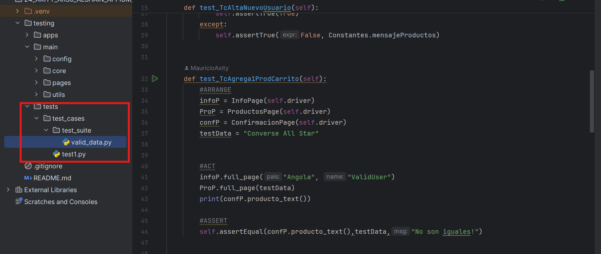
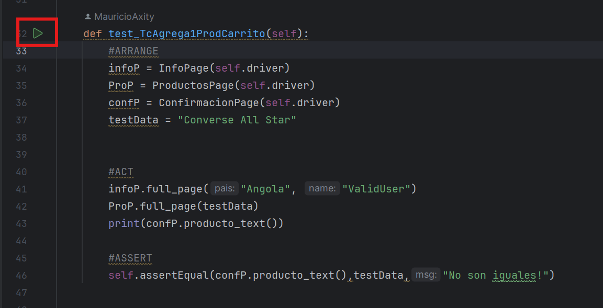
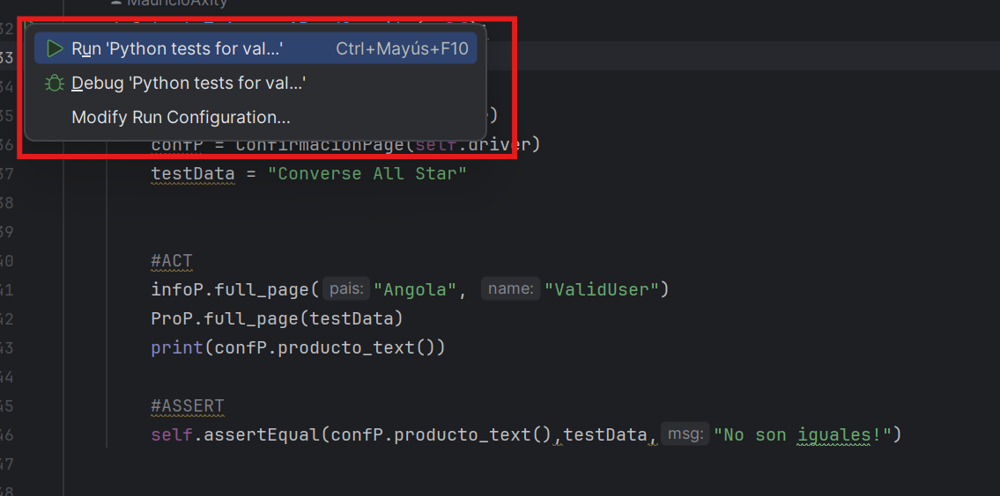
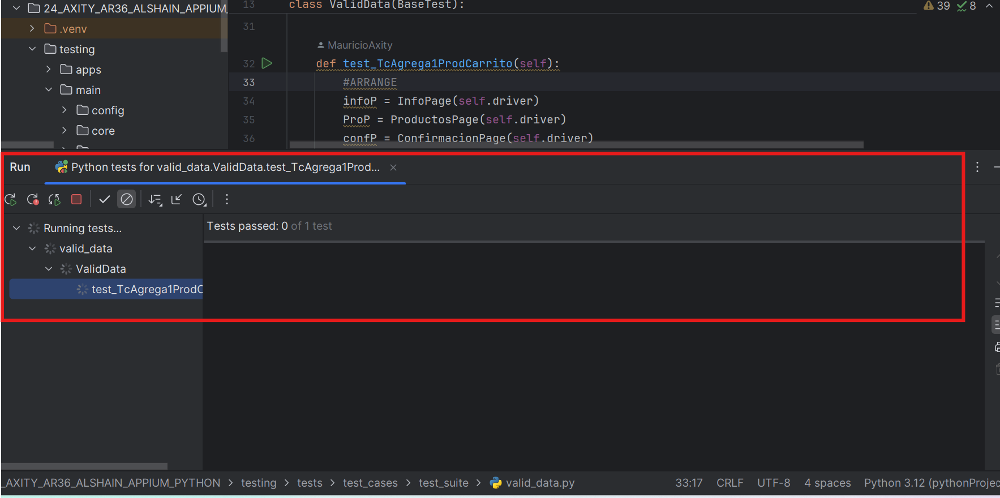
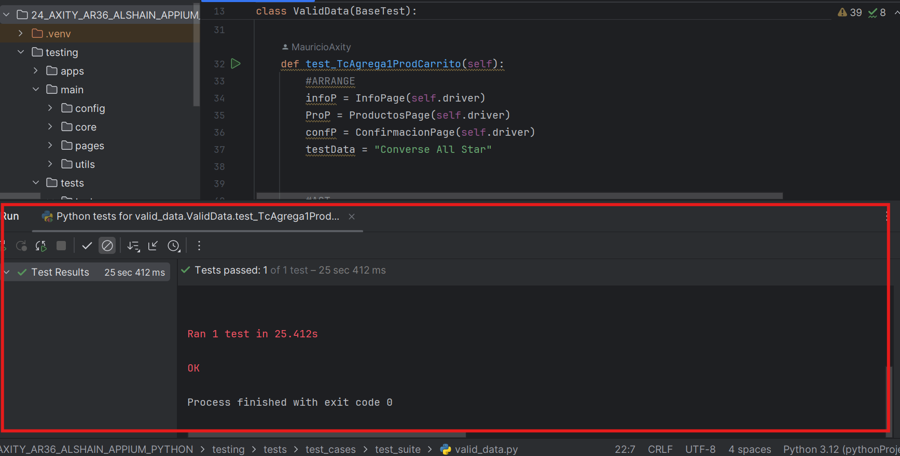
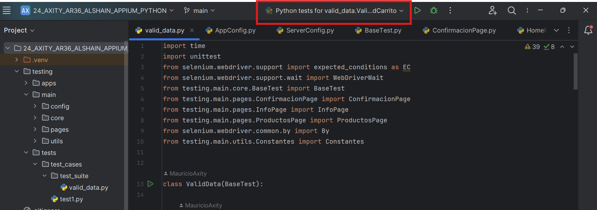
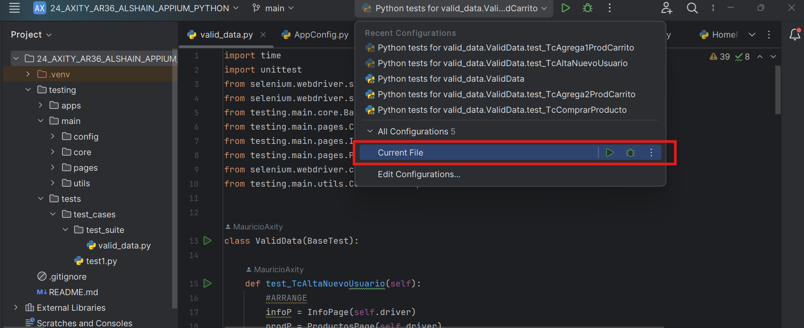
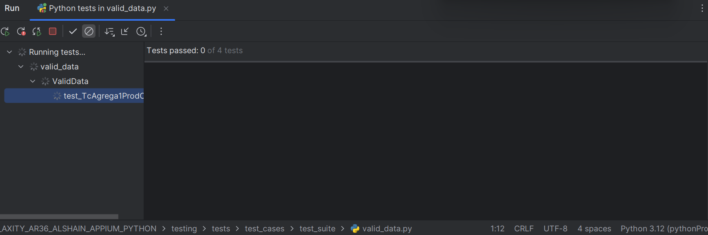
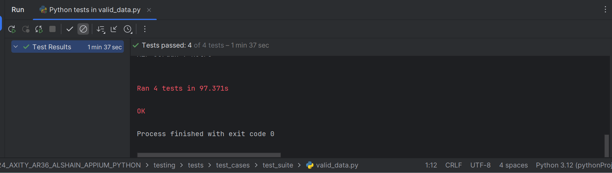

# Arquetipo-Appium
- Alshain es un ARTE basado en la herramienta de automatización de pruebas Appium, diseñado para realizar pruebas automatizadas en aplicaciones móviles y web. Escrito en Python, integra bibliotecas y complementos que permiten realizar pruebas exhaustivas de funcionalidades, asegurando la calidad y el correcto funcionamiento de las aplicaciones. Los resultados de las pruebas se recopilan y presentan utilizando variedades de librerías, proporcionando informes detallados que incluyen resultados de las pruebas ejecutadas, facilitando así el análisis y la mejora continua de las aplicaciones.

## Requerimientos de Software​
 - 1. PyCharm: https://www.jetbrains.com/pycharm/download/?section=windows

       Nota: Descargar la versión Community Edition .exe.
 - 2. Python: https://www.python.org/downloads/
 - 3. Appium  (*Se instalan por comandos en CMD. Primero descargar Node JS*​)
 - 4. Appium Inspector (Para Inspeccionar Elementos en la App): https://github.com/appium/appium-inspector/releases
 - 5. Node JS: https://nodejs.org/en/download/package-manager/current
 - 6. UI2automator Driver: Se instalan por comandos en CMD. (*Se instalan por comandos en CMD. Primero descargar Node JS*​)
 - 7. Android Studio (Para hacer las emulaciones del dispositivo movil): https://developer.android.com/studio?hl=es-419
 - 8. Platforms Tools: https://dl.google.com/android/repository/platform-tools-latest-windows.zip?hl=es-419
 - 9. Java SE Development Kit 9.0.4 (JDK) (*Crear o tener cuenta de ORACLE para agilizar el proceso de descarga de JDK*​): https://www.oracle.com/mx/java/technologies/javase/javase9-archive-downloads.html

## Configuración PC
 - Paso 1: Instalar todos los requerimientos de software seleccionando opciones por defecto durante la instalación.
 - Paso 2: Para instalar Appium y UI2automator driver abrir la consola de comandos (CMD) y poner los siguientes comandos:​
     - npm i --location=global appium​
     - appium driver install uiautomator2​

  
     Nota: Abrir la consola de comandos (CMD) en modo administrador. En caso de que alguno de los dos comandos no ejecute puedes 
     considerar alguno de las siguientes opciones, dependerá de las configuraciones en caché de tu equipo el comando más adecuado :

     -npm install appium
   
     -npm install -g npm@10.8.3
   
     -npm cache clean --force
   
     -npm install --location=global appium
   
     -npm install -g appium
   
     -appium driver install uiautomator2   

 - Paso 4: Mover carpeta de Platform - Tools a nuestro disco C:/​
 - Paso 5: Ir a propiedades del sistema (Click derecho sobre "Este Equipo" dentro el explorador de archivos). ​
 - Paso 6: Hacer click en "Configuración Avanzada del Sistema"​
 - Paso 7: Hacer click en variables de entorno.​

 - Paso 8: Crear variables de Usuario ​
     *AppData* es una carpeta oculta​
     JAVA_HOME: C:\Program Files\Java\jdk-9.0.4\bin​
     ANDROID_HOME: C:\Users\NombredelUsuario\AppData\Local\Android\Sdk​
​
 - Paso 9: Agregar variables de entorno en nuestra computadora dentro de "Path"​
     %JAVA_HOME%​
     %ANDROID_HOME%\platform-tools\​
     %ANDROID_HOME%\platform-tools\adb​
     C:\platform-tools

## Configuración Android Studio
- Paso 1: Abrir Android Studio​
- Paso 2: Crear proyecto ​
- Paso 3: En "Phone and Tablet" Seleccionar "No Activity"​
  
  Nota: Dependiendo el proyecto usar una versión especifica del Android.
- Paso 4: Guardar Proyecto​
- Paso 5: En la barra lateral derecha seleccionar "Device Manager"​
- Paso 6: Dar clic en "+" Para Agregar un emulador​
- Paso 7: Seleccionar emulador según los requerimientos
- Paso 8: Seleccionar una imagen de sistema.​
- Paso 9: Verificar la configuración establecida.​
- Paso 10: Dar clic en "terminar".​
- Paso 11: Para inicializar la emulación dar clic en "Start" en Device Manager.​
- Paso 12: Validar el dispositivo desde CMD utilizando el comando: adb devices.

## Configuración Appium Inspector ​

- Paso 1: Abrir Appium Inspector​
- Paso 2: En Remote Host: 127.0.0.1​
- Paso 3: En Remote Port: 4723​
- Paso 4: En Desired Capabilities agregar:​
     Nombre del emulador (El nombre del dispositivo en Android Studio)​
     Nombre del driver     (UI2automator)​
     Nombre del Sistema Operativo (Android)

## Instalación de la Aplicación Desde Android Studio

- Paso 1: Abrir Android Studio​
- Paso 2: Inicializar el emulador​
- Paso 3: Ir a la ubicación del archivo apk.​
- Paso 4: Arrastrar archivo hacia la emulación.​
- Paso 5: Validar la aplicación se haya instalado correctamente entrando.

## Instalación de la Aplicación  Desde la Terminal CMD

- Paso 1: Configurar el dispositivo movil en "modo desarrollador"​
- Paso 2: Activar USB debugging.​
- Paso 3: Abrir CMD​
- Paso 4: Utilizar comando: adb devices para validar nuestro dispositivo móvil.​
- Paso 5: Utilizar el comando: adb install + ruta del archivo apk​
- Paso 6: Validar que se haya instalado correctamente en nuestro dispositivo móvil entrando a la app.

## Estructura del Framework

 - **drivers**
     - En la carpeta de Drivers encontraremos una caperta de Apps que son las aplicaciones moviles donde se realizarán las pruebas automatizadas 

 - **main**
     - **config** 
         - **AppConfig:** Se encarga de definir los atributos clave de una aplicación específica que será utilizada para realizar pruebas automatizadas. Estos atributos incluyen el paquete y la actividad principal de la aplicación, así como el nombre del sistema operativo y del dispositivo. Además, proporciona un método para obtener las capacidades necesarias de Appium para automatizar pruebas en dispositivos Android. En conjunto, esta clase sirve como un punto centralizado para configurar los detalles esenciales de la aplicación de prueba, facilitando así el mantenimiento y la reutilización del código en el proceso de automatización de pruebas.

         - **ServerConfig:**  Facilita la gestión del servidor de Appium para las pruebas automatizadas. A través de sus métodos, permite obtener la dirección del servidor de Appium, ya sea desde una variable de entorno específica o utilizando una dirección predeterminada. Además, ofrece la capacidad de iniciar un servicio local de Appium en un puerto y dirección IP personalizados, o utilizar valores por defecto. En conjunto, esta clase simplifica la configuración y el inicio del servidor de Appium, proporcionando así una base sólida para la ejecución de pruebas automatizadas en entornos de desarrollo y prueba.
    
     - **core** 
         - La clase BaseTest.py, se utiliza como una clase base para las pruebas en el marco de unittest. Extiende la configuración de la aplicación AppConfig, proporcionando un punto de partida común para todas las pruebas. En el método SetUp, que se ejecuta antes de cada prueba, se configuran y se inician los servicios necesarios para la ejecución de las pruebas, como el servidor de Appium y el controlador de Android. En el método TearDown, que se ejecuta después de cada prueba, se lleva a cabo la limpieza y finalización de las pruebas, cerrando la aplicación bajo prueba y liberando los recursos del controlador de Android. En resumen, la clase BaseTest establece un entorno coherente y automatizado para la ejecución de pruebas en el marco de unittest, facilitando la gestión de la configuración y limpieza antes y después de cada prueba.

     - **pages**
         - Son clases de páginas que representan diferentes pantallas o funcionalidades de una aplicación móvil que se está probando utilizando Appium y unittest . Cada clase de página contiene métodos para interactuar con los elementos de la interfaz de usuario en una pantalla específica de la aplicación móvil, lo que permite automatizar las pruebas de manera más eficiente y estructurada. 
         
         - El primer script corresponde a la clase  HomePage, que inicializa la página de inicio de la aplicación y define localizadores para elementos en esta pantalla.
         
         - El segundo script corresponde a la clase InfoPage, que maneja las interacciones en la página de información de la aplicación, como ingresar un nombre de usuario, seleccionar un género, y elegir un país de una lista desplegable.
         
         - El tercer script es la clase ProductosPage, que define métodos para buscar y seleccionar productos en la página de productos de la aplicación, así como para acceder al carrito de compras. 
         
         - El cuarto script es la clase ConfirmacionPage, que define métodos para interactuar con elementos de la pantalla de confirmación de la aplicación, como hacer clic en una casilla de verificación y en un botón de confirmación.

     - **utils**
         - Cuenta con una clase Constantes.py la cual es el conjunto de todas las constantes utilizadas en el framework se pueden agregar más si así se requiere. Se tiene un Folder llamado Actions que cuenta con: la clase Accions.py en el contexto de Appium proporciona una abstracción para realizar acciones comunes en aplicaciones móviles utilizando Appium, lo que permite un código más limpio y mantenible al encapsular la lógica de Appium en métodos reutilizables. Estos métodos pueden incluir acciones como hacer clic en elementos, ingresar texto, deslizar la pantalla, entre otras. Las constantes definidas aquí pueden ser referenciadas desde otras clases dentro del proyecto de Appium para asegurar una gestión eficiente y consistente de los valores utilizados en la automatización de pruebas. 

 - **tests**
     - **test_cases**
         - **test_suite** 
             - **valid_data.py:** Es una suite de pruebas de datos de prueba validos
             - **test1.py**: Es una suite de pruebas generales.

## Ejecución de una prueba
### Ejecutar un caso de prueba 
  - Paso 1: Seleccionar el script donde están los casos de prueba.
  

  - Paso 2: Abrir el CMD añadiendo los siguientes comandos: 'pip install selenium' 'pip install Appium-Python-Client'.

    Ubicar el caso de prueba a ejecutar y dar click sobre el triangulo verde
   

  - Paso 3: Se abre el menu y dar click sobre "Run Python test"
  

  - Paso 4: Visualizar en la Consola del IDE que se empieze a ejecutar nuestra prueba.
  

  - Paso 5: Visualizar el Resultado de nuestra prueba si PASSED o FAILED
  

  ### Ejecutar multiples casos de prueba 
  - Paso 1: Seleccionar el script donde están los casos de prueba
   

  - Paso 2: Situarnos en el menú posterior de pycharm y dar click en el menú
   

  - Paso 3: Se abre el menu y dar click "Current File"
  

  - Paso 4: Dar click en el triangulo verde para que se ejectute todas las pruebas que esten en el script
  

  - Paso 5: Visualizar el Resultado de nuestra prueba si PASSED o FAILED
  

   
